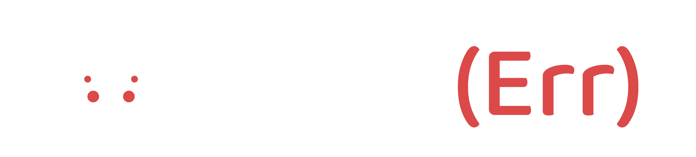

# Learn(Err) API V1

## Introduction

Projet d'apothéose née d'une collaboration entre 4 personnes : 2 front-end, 2 back-end

Equipe front-end : Julien Goletto & Pierre Arragain

Equipe back-end : Frédéric Basler & Helene Nguyen

___

## Technologies

Pour le développement de l'API, nous travaillerons avec l'environnement **NodeJS** ainsi que son framework **Express**.

Nous allons utiliser **Sqitch** pour le versioning et la migration de la bases de données.

Pour ce qui est de la gestion de notre base de données (SBGD) notre décision c'est porté sur **PostgreSQL**.

Les test au sein de notre API seront effectués par **Jest**.

Création de toute la documentation de notre API avec l'aide de **Swagger**.

___

## Sommaire

1. [Etude du projet](__docs__/01_mise_en_place.md)
2. [Base de données](__docs__/02_base_de_donnees.md)
3. [Initialisation](__docs__/03_initialisation.md)
4. [Serveur](__docs__/04_serveur.md)
5. [Schéma](__docs__/05_schema.md)
6. [Error Logger](__docs__/06_error_logger.md)
7. [Error Handler](__docs__/07_error_handler.md)
8. [Authentification](__docs__/08_auth.md)
9. [DataMapper](__docs__/09_datamapper.md)
10. [Routes](__docs__/10_routes.md)
11. [Swagger Docs](__docs__/11_swagger_docs.md)
12. [Controllers](__docs__/12_controllers.md)
13. [Rest Client](__docs__/13_restClient.md)

___

## Sources

### Sources technologies

- [NodeJS](https://nodejs.org/en/)
- [Express](https://expressjs.com/fr/)
- [SQL](https://sql.sh/)
- [Node-PostgreSQL](https://node-postgres.com/)
- [PostgreSQL](https://www.postgresql.org/)
- [Sqitch](https://sqitch.org/)
- [Jest](https://jestjs.io/fr/)
- [Swagger](https://swagger.io/)

### Sources NPM (Node Package Manager)

- [Dotenv](https://www.npmjs.com/package/dotenv)
- [Pg](https://www.npmjs.com/package/pg)
- [Express](https://www.npmjs.com/package/express)
- [Express-session](https://www.npmjs.com/package/express-session)
- [JsonWebToken](https://www.npmjs.com/package/jsonwebtoken)
- [Helmet](https://www.npmjs.com/package/helmet)
- [Joi](https://www.npmjs.com/package/joi)
- [Bcrypt](https://www.npmjs.com/package/bcrypt)
- [swagger-jsdoc](https://www.npmjs.com/package/swagger-jsdoc)
- [swagger-ui-express](https://www.npmjs.com/package/swagger-ui-express)

- Dépendances dev :

  - [Debug](https://www.npmjs.com/package/debug)
  - [Bad Words List french](https://www.npmjs.com/package/french-badwords-list)
  - [@shiroi-shi/techstack](https://www.npmjs.com/package/@shiroi-shi/techstack)
  - [@faker-js/faker](https://www.npmjs.com/package/@faker-js/faker)
  - [Jest](https://www.npmjs.com/package/jest)

### Extensions VSCODE et logiciel

- Rest Client
- Insomnia
- Database Client
- LiveShare

### Sources SQL/PostgreSQL

- [Boundaries](https://stackoverflow.com/questions/3825676/postgresql-regex-word-boundaries)
- [ILIKE with variables](https://github.com/lib/pq/issues/495)
- [JsonAgg](https://sql.tutorialink.com/how-to-specify-a-limit-on-postgres-json_agg/)

### Sources Javascript

- [Destructuring](https://ultimatecourses.com/blog/remove-object-properties-destructuring)
