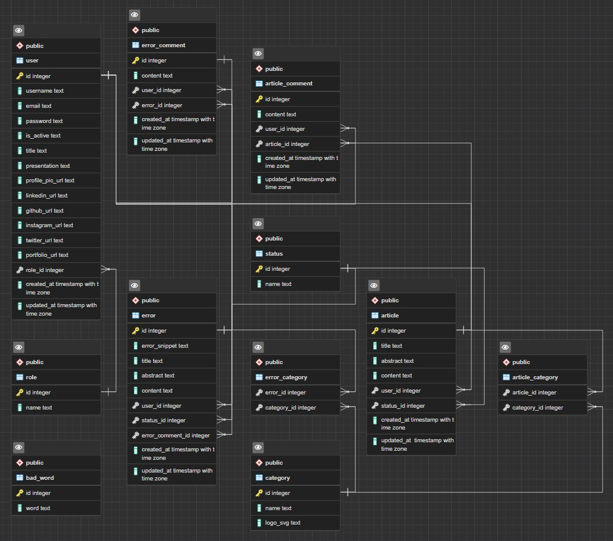

# 01. Etude du projet

## User Stories

Les User stories est une démarche qui permettra, en de simples descriptions, d'exprimer les besoins ou les attentes d'un utilisateur.

Cela nous permettra de déterminer les fonctionnalités à développer.

Nous avons 4 grandes catégories de personnes :

- visiteur
- utilisateur
- auteur
- admin

Ci-dessous le détail de chaque catégorie :
___

## Visiteur

| En tant que | J'ai besoin de | Afin de | Commentaire | Sprint |
| --- | --- | --- | --- | --- |
| visiteur | afficher la page d'accueil | prendre connaissance des derniers contenus |  |  |
| visiteur | afficher la page d'inscription | créer un compte |  |  |
| visiteur | afficher la page de connexion | s'identifier | sous forme de menu utilisateur |  |
| visiteur | consulter un article | enrichir mes connaissances |  |  |
| visiteur | afficher la page des articles | prendre connaissance de tous les articles et des commentaires |  |  |
| visiteur | moteur de recherche | trouver mon erreur |  |  |
| visiteur | afficher la page des erreurs | prendre connaissance de toutes les erreurs |  |  |
| visiteur | afficher le ticket d'une erreur | trouver la solution à l'erreur |  |  |

## Utilisateur

| En tant que | J'ai besoin de | Afin de | Commentaire | Sprint |
| --- |---  | --- | --- | --- |
| utilisateur | afficher sa page utilisateur | consulter et modifier le contenu |  |  |
| utilisateur | afficher une page utilisateur | consulter le profil d'un autre utilisateur | option : suivre un utilisateur |  |
|---||||
| utilisateur | afficher un formulaire de création d'erreur | soumettre une erreur aux administrateurs |  |  |
| utilisateur | un bouton d'édition sur l'erreur | éditer une erreur |  |  |
| utilisateur | un bouton suppression de l'erreur | supprimer une erreur |  |  |
|---||||
| utilisateur | un formulaire sur un ticket erreur | poster une réponse |  |  |
| utilisateur | un bouton d'édition d'une réponse | éditer une réponse |  |  |
| utilisateur | un bouton suppression d'une réponse | supprimer une réponse |  |  |
|---||||
| utilisateur | un bouton de publication du commentaire sur un article| publier un commentaire |  |  |
| utilisateur | un bouton d'édition du commentaire sur un article| éditer un commentaire |  |  |
| utilisateur | un bouton suppression du commentaire sur un article | supprimer un commentaire |  |  |
|---||||
| utilisateur | un bouton sur une réponse de son ticket d'erreur | clôturer le ticket et valider la réponse |  |  |
| utilisateur | un bouton de vote sur chaque réponse d'un ticket d'erreur | mettre en avant une réponse | optionnel (cheers) |  |
| utilisateur | ouvrir le menu | sortir de sa session |  |  |

## Auteur

| En tant que | J'ai besoin de | Afin de | Commentaire | Sprint |
| --- | --- | --- | --- | --- |
| auteur | formulaire de création d'articles | rédiger un article |  |  |
| auteur | bouton de suppression de l'article | supprimer l'article |  |  |
| auteur | formulaire d'édition d'un article | éditer un article / éditer le brouillon |  |  |
|---||||
| auteur | afficher la page de mes articles | consulter l'état de mes articles et atteindre les pages d'édition de mes articles |  |  |
|---||||
| auteur | bouton de validation de l'article | soumettre l'article aux administrateurs |  |  |
| auteur | bouton d'enregistrement de l'article en brouillons | enregistrer le brouillon de l'article |  |  |
|---|||||
| auteur | formulaire de création de tickets d'erreurs | rédiger un ticket d'erreur |  |  |
| auteur | bouton de suppression du ticket d'erreur  |supprimer un ticket d'erreur | | |  |
| auteur | formulaire d'édition d'un ticket d'erreur | éditer un ticket d'erreur / éditer le brouillon |  |  |
|---||||
| auteur | afficher la page de mes tickets erreurs | consulter l'état de mes tickets et atteindre les pages d'édition de mes tickets |  |  |
|---||||
| auteur | bouton de validation du ticket d'erreur | soumettre le ticket d'erreur |aux administrateurs |  |  |
| auteur | bouton d'enregistrement du ticket en brouillons | enregistrer le brouillon du ticket d'erreur |  |  |

## Admin

| En tant que | J'ai besoin de | Afin de | Commentaire | Sprint |
| --- | --- | --- | --- | --- |
| admin | afficher les articles en attente de validation | valider ou supprimer les articles  |  |  |
| admin | afficher les tickets en attente de validation | valider ou supprimer les tickets  |  |  |
| admin | afficher la liste des utilisateurs | promouvoir ou désactiver un utilisateur |  |  |
| admin | un bouton de création de catégorie | création d'une catégorie |  |  |
| admin | un bouton de suppression de catégorie| supprimer une catégorie |  |  |

## MCD

## MLD

## MPD

## Endpoints

## /API/V1

### <u>User</u>

|Method| Route| Description| Returns |Page|
|---|---|---|---|---|
| GET | /users | Récupérer tous les utilisateurs | Tableau d'objets JSON | Dashboard Admin |
| GET | /users/:id | Récupérer un utilisateur par son id | Tableau d'objets JSON | profil utilisateur |
| POST | /signin | Connexion | Objet JSON avec les tokens | Modale de connexion |
| POST | /signup | Inscription | String de confirmation | Page inscription|
| GET | /signout | Déconnexion | String de confirmation | Modale de déconnexion |
| PATCH | /users/:id | Mise à jour des informations de profil | String de confirmation | Page profil de l'utilisateur|
| DELETE | /users/:id | Suppression d'un compte utilisateur | Objet JSON | Dashboard |
| PUT | /users/:id | Désactivation d'un utilisateur | Objet JSON | Dashboard admin |
| GET | /users/:id/comments | Récupérer tous les commentaires d'un utilisateur |Tableau d'objets JSON | Dashboard admin |
|POST|/refreshToken| Met à jour le token pour les autorisations| Objet JSON | Dashboard admin, utilisateur et auteur, page profil, page de creation de ticket d'erreur et d'article|

## <u>Articles</u>

|Method| Route| Description| Returns|Page|
|---|---|---|---|---|
| GET | /articles | Récupérer tous les articles | Tableau d'objets JSON | Page articles |
| GET | /articles/:id | Récupération d'un article par son id | Objet JSON | Page d'un article |
| POST | /articles | Soumettre l'article aux administrateurs| String de confirmation "en attente de validation" | Dashboard Auteur - Page de création d'article |
| PATCH | /articles/:id | Mise à jour d'un article |String "article mis à jour"| Dashboard Auteur - Page de création d'article |
| DELETE | /articles/:id | Suppression d'un article |  String "article supprimé"   | Page Dashboard auteur|
| GET | /categories/:id/articles | Récupérer tous les articles d'une catégorie | Tableau d'objets JSON | Page articles |
| GET | /users/:id/articles | Récupérer tous les articles d'un utilisateur | Tableau d'objets JSON | Profil auteur |
| POST | /articles/last | Récupérer les derniers articles publiés | Tableau d'objets JSON | Home / Page articles ? |
| POST | /articles/search | Récupérer les articles liés à la recherche | Tableau d'objets JSON | Toutes les pages |

### <u>Errors</u>

|Method| Route| Description| Returns|Page|
|---|---|---|---|---|
| GET | /errors | Récupérer tous les tickets d'erreur | Tableau d'objets JSON | Page tickets d'erreur |
| GET | /errors/:id | Récupération d'un ticket d'erreur par son id | Tableau d'objets JSON | Page d'un ticket d'erreur|
| POST | /errors | Soumettre le ticket d'erreur | String de confirmation "en attente de validation" |Création d'erreur|
| PATCH | /errors/:id | Mise à jour d'un ticket d'erreur | String "ticket d'erreur mise à jour" | Dashboard utilisateur - Page de création d'erreur |
| DELETE | /errors/:id | Suppression d'un ticket d'erreur | String "ticket d'erreur supprimé" | Dashboard utilisateur - Page de création d'erreur |
| GET | /categories/:id/errors | Récupérer tous les tickets d'erreur d'une catégorie | Tableau d'objets JSON | Page tickets d'erreur |
| GET | /users/:id/errors | Récupérer tous les tickets d'erreur d'un utilisateur | Tableau d'objets JSON | Profil utilisateur
| POST | /errors/last | Récupérer les derniers tickets d'erreur publiés | Tableau d'objets JSON | Home |
| POST | /errors/search | Récupérer les tickets d'erreur liés à la recherche | Tableau d'objets JSON | Toutes les pages |
| PATCH | /errors/:id/solution/:id | Valider un commentaire comme solution au ticket | String de confirmation | Page ticket d'erreur (auteur de l'erreur seulement) |

### <u>Article comments</u>

|Method| Route| Description| Returns|Page|
|---|---|---|---|---|
| GET | /articles/:id/comments | Récupérer tous les commentaires d'un article | Tableau d'objets JSON | Page article |
| POST | /articles/:id/comments | Publier un commentaire sur un article | String de confirmation | Page article |
| PATCH | /articles/:id/comments/:id | Mettre à jour un commentaire sur un article | String de confirmation | Page article |
| DELETE | /articles/:id/comments/:id | Suppression d'un commentaire sur un article | String de confirmation | Page article |
| GET | /users/:id/article_comments | Récupérer toutes les réponses d'un utilisateur à des articles | Tableau d'objets JSON | Page profil |

### <u>Error comments</u>

|Method| Route| Description| Returns|Page|
|---|---|---|---|---|
| GET | /errors/:id/comments | Récupérer tous les commentaires d'un ticket d'erreur | Tableau d'objets JSON | Page ticket d'erreur
| POST | /errors/:id/comments | Publier un commentaire sur un ticket d'erreur | String de confirmation | Page ticket d'erreur
| PATCH | /errors/:id/comments/:id | Mettre à jour un commentaire sur un ticket d'erreur | String de confirmation | Page ticket d'erreur
| DELETE | /errors/:id/comments/:id | Suppression d'un commentaire sur un ticket d'erreur | String de confirmation | Page ticket d'erreur
| GET | /users/:id/error_comments | Récupérer toutes les réponses d'un utilisateur à des tickets d'erreur | Tableau d'objets JSON | Page profil |

### <u>Categories</u>

|Method| Route| Description| Returns|Page|
|---|---|---|---|---|
| GET | /categories | Récupérer toutes les catégories | Tableau d'objets JSON | Home/Page articles/Page tickets d'erreurs/Création d'articles /Création d'erreur/ Profil utilisateur |
| GET | /articles/:id/categories | Récupérer toutes les catégories en fonction d'un article | Tableau d'objets JSON | Page article
| GET | /errors/:id/categories | Récupérer toutes les catégories en fonction d'un ticket d'erreur | Tableau d'objets JSON | Page ticket d'erreur
| POST | /categories | Créer une catégorie | String de confirmation | Dashboard Admin |
| DELETE | /categories/:id | Supprimer une catégorie | String de confirmation | Dashboard Admin |

## Architecture de l'API

___

[Retour à l'accueil](../README.md) / [Chapitre suivant](02_base_de_donnees.md)